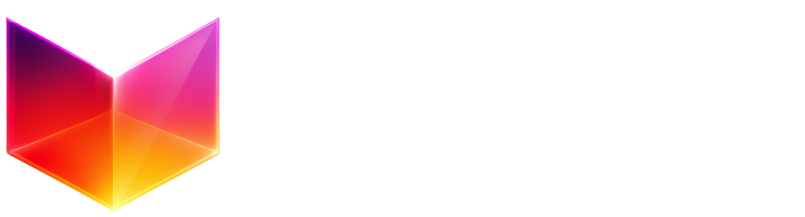

# Delta XR - Immersive 3D E-Commerce Platform

<div align="center">



**A cutting-edge 3D e-commerce platform that transforms online shopping through immersive WebXR experiences**

[](https://reactjs.org/)
[](https://threejs.org/)
[](https://www.typescriptlang.org/)
[](https://vitejs.dev/)
[](https://shopify.dev/)

</div>

---

## 🌟 Overview

Delta XR revolutionizes e-commerce by creating immersive 3D shopping environments where customers can explore products in photorealistic virtual spaces. Built with modern web technologies, it seamlessly integrates with Shopify to provide a complete retail solution that bridges the gap between physical and digital shopping experiences.

### 🎯 Core Features

- **🏪 Immersive 3D Environments** - Multiple themed virtual stores (Castle, Luxe Cradle, Glow Bar, etc.)
- **🛍️ Interactive Product Visualization** - 3D models, 360° product views, and AR try-on capabilities
- **🔐 Secure Authentication** - Google OAuth integration with JWT token management
- **📱 Responsive Design** - Desktop-optimized with mobile detection and redirection
- **⚡ Real-time Performance** - Optimized 3D rendering with dynamic loading and caching
- **🎨 Brand Customization** - Multi-tenant architecture supporting unlimited brands
- **🔍 Advanced Search** - Fuzzy search with spatial navigation to products
- **📊 Performance Monitoring** - Built-in performance analytics and debugging tools

---

## 🏗️ Architecture

### Technology Stack

**Frontend Core:**
- **React 18.2** - Modern UI framework with concurrent features
- **TypeScript** - Type-safe development with enhanced IDE support
- **Vite** - Lightning-fast build tool and development server
- **SCSS/Sass** - Advanced styling with variables and mixins

**3D Graphics & WebXR:**
- **Three.js 0.171** - Industry-standard 3D graphics library
- **React Three Fiber** - React renderer for Three.js
- **React Three Drei** - Useful helpers and abstractions for R3F
- **React Three Rapier** - Physics engine integration

**State Management:**
- **Zustand** - Lightweight, scalable state management
- **React Router DOM** - Client-side routing with query parameter preservation

**E-commerce Integration:**
- **Shopify Hydrogen React** - Official Shopify React components
- **Shopify Buy SDK** - Direct Storefront API integration

**UI/UX Libraries:**
- **Material-UI (MUI)** - Comprehensive React component library
- **Lucide React** - Beautiful, customizable icons
- **GSAP** - Professional-grade animations
- **Canvas Confetti** - Celebration effects

**Authentication & Security:**
- **Google OAuth** - Secure authentication flow
- **JS-Cookie** - Secure cookie management
- **DOMPurify** - XSS protection for user content

### Project Structure

```
src/
├── api/                    # Backend service integrations
│   ├── shopifyAPIService.ts   # Shopify Storefront API
│   ├── brandService.ts        # Brand management
│   ├── assetService.ts        # 3D asset handling
│   └── envStoreService.ts     # Environment persistence
├── world/                  # 3D scene components
│   ├── App.jsx               # Main 3D scene orchestrator
│   ├── CameraController.jsx  # Camera movement & controls
│   ├── Products.jsx          # Product 3D representations
│   ├── Lights.jsx           # Scene lighting setup
│   └── Skybox.jsx           # Environment backgrounds
├── UI/                     # User interface components
│   ├── Components/           # Reusable UI components
│   └── UI.tsx               # Main UI orchestrator
├── stores/                 # State management
│   └── ZustandStores.ts     # All application stores
├── Types/                  # TypeScript definitions
└── utils/                  # Utility functions
```

---

## 🚀 Quick Start

### Prerequisites

- **Node.js** ≥ 18.0.0
- **npm** ≥ 8.0.0 or **yarn** ≥ 1.22.0
- Modern browser with WebGL 2.0 support
- **Google OAuth 2.0** credentials (for authentication)

### Installation

1. **Clone the repository**
   ```bash
   git clone https://github.com/your-org/delta-xr.git
   cd delta-xr
   ```

2. **Install dependencies**
   ```bash
   npm install
   ```

3. **Environment setup**
   ```bash
   cp .env.local.example .env.local
   ```
   
   Configure your environment variables:
   ```env
   VITE_GOOGLE_CLIENT_ID=your_google_client_id
   VITE_GOOGLE_CLIENT_SECRET=your_google_client_secret
   PORT=5173
   GENERATE_SOURCEMAP=false
   ```

4. **Start development server**
   ```bash
   npm run dev
   ```

5. **Access the application**
   - Open `http://localhost:5173` in your browser
   - The app will redirect to authentication if not logged in
   - Use query parameters: `?env=Castle&brandName=your-brand`

### Build for Production

```bash
# Create optimized production build
npm run build

# Preview production build locally
npm run preview

# Lint code
npm run lint
```

---

## 🎮 Usage Guide

### Authentication Flow

1. **Initial Access**: Navigate to the application URL with brand parameters
2. **Google OAuth**: Sign in using your Google account
3. **Brand Validation**: System validates brand credentials and permissions
4. **Environment Loading**: 3D environment loads based on brand configuration

### 3D Environment Navigation

- **Mouse Controls**: Click and drag to rotate camera view
- **Keyboard**: WASD keys for movement (if enabled)
- **Product Interaction**: Click on products to view details
- **Search**: Use the search bar to find and navigate to specific products

### Brand Management

Each brand can customize:
- **Environment Theme**: Choose from multiple 3D environments
- **Product Catalog**: Sync with Shopify store inventory
- **Brand Assets**: Upload custom logos, posters, and media
- **3D Models**: Add custom 3D representations of products

---

## 🔧 Configuration

### Environment Variables

| Variable | Description | Required |
|----------|-------------|----------|
| `VITE_GOOGLE_CLIENT_ID` | Google OAuth client ID | ✅ |
| `VITE_GOOGLE_CLIENT_SECRET` | Google OAuth client secret | ✅ |
| `PORT` | Development server port | ❌ |
| `GENERATE_SOURCEMAP` | Generate source maps for debugging | ❌ |

### Shopify Integration

The platform integrates with Shopify through:
- **Storefront API**: Product catalog synchronization
- **Webhook Events**: Real-time inventory updates
- **Custom Apps**: Brand-specific configurations

### 3D Environment Configuration

Environments support different rendering configurations:
- **Tone Mapping**: Linear vs ACES Filmic tone mapping
- **Exposure Settings**: Per-environment exposure values
- **Asset Loading**: Dynamic 3D model and texture loading
- **Performance Optimization**: LOD (Level of Detail) management

---

## 🎨 Customization

### Adding New Environments

1. Create environment assets (HDR, textures, models)
2. Add environment configuration to `useEnvironmentStore`
3. Implement environment-specific lighting in `Lights.jsx`
4. Configure tone mapping settings in `CanvasWrapper.tsx`

### Custom 3D Models

Supported formats:
- **GLTF/GLB** - Recommended for 3D models
- **KTX2** - Compressed textures for better performance
- **HDR** - High dynamic range environments

### Brand Theming

Each brand can customize:
- Color schemes and typography
- Logo and branding assets
- Custom 3D environments
- Product presentation styles

---

## 📊 Performance Optimization

### 3D Rendering Optimizations

- **Frustum Culling**: Only render visible objects
- **Texture Compression**: KTX2 format for smaller file sizes
- **Model Optimization**: Automatic LOD generation
- **Instanced Rendering**: Efficient rendering of repeated objects

### Loading Strategies

- **Progressive Loading**: Assets load in priority order
- **Preloading**: Critical assets cached on initial load
- **Lazy Loading**: Non-critical assets loaded on demand
- **Error Recovery**: Graceful fallbacks for failed assets

### Performance Monitoring

Built-in performance tools:
- **R3F Perf**: Real-time 3D performance metrics
- **Resource Tracking**: Monitor loading states
- **Error Boundaries**: Graceful error handling

---

## 🧪 Testing

### Running Tests

```bash
# Run all tests
npm test

# Run tests in watch mode
npm run test:watch

# Generate coverage report
npm run test:coverage
```

### Testing Strategy

- **Unit Tests**: Individual component functionality
- **Integration Tests**: API service interactions
- **E2E Tests**: Complete user workflows
- **Performance Tests**: 3D rendering benchmarks

---

## 🚢 Deployment

### Netlify Deployment

The project is configured for Netlify deployment:

```toml
# netlify.toml
[[redirects]]
  from = "/*"
  to = "/index.html"
  status = 200
```

### Build Optimization

Production builds include:
- **Code Splitting**: Automatic chunk splitting
- **Tree Shaking**: Remove unused code
- **Asset Optimization**: Compressed images and models
- **CDN Integration**: Optimized asset delivery

### Environment-Specific Builds

- **Development**: Source maps, hot reload, debug tools
- **Staging**: Production-like with debugging enabled
- **Production**: Fully optimized, no debug tools

---

## 🤝 Contributing

We welcome contributions! Please follow these guidelines:

### Development Workflow

1. **Fork** the repository
2. **Create** a feature branch (`git checkout -b feature/amazing-feature`)
3. **Commit** your changes (`git commit -m 'Add amazing feature'`)
4. **Push** to the branch (`git push origin feature/amazing-feature`)
5. **Open** a Pull Request

### Code Standards

- **TypeScript**: Use strict type checking
- **ESLint**: Follow configured linting rules
- **Prettier**: Consistent code formatting
- **Conventional Commits**: Structured commit messages

### Pull Request Process

1. Ensure all tests pass
2. Update documentation as needed
3. Add screenshots for UI changes
4. Request review from maintainers

---

## 📚 API Reference

### Core Services

#### ProductService
```typescript
// Get all products for a brand
ProductService.getAllProducts(brandName: string): Promise<Product[]>

// Get library assets
ProductService.getLibraryAssets(brandName: string): Promise<EnvAsset[]>
```

#### BrandService
```typescript
// Fetch brand configuration
BrandService.fetchBrandData(brandName: string): Promise<BrandData>
```

#### EnvStoreService
```typescript
// Load environment data
EnvStoreService.getEnvData(brandName: string): Promise<EnvData>

// Save environment configuration
EnvStoreService.storeEnvData(brandName: string, products: EnvProduct[], assets: EnvAsset[]): Promise<void>
```

---

## 🔍 Troubleshooting

### Common Issues

**3D Models Not Loading**
- Check file format (GLTF/GLB recommended)
- Verify file size limits
- Ensure proper CORS headers

**Authentication Failures**
- Verify Google OAuth credentials
- Check redirect URI configuration
- Ensure cookies are enabled

**Performance Issues**
- Enable performance monitoring
- Check browser WebGL support
- Reduce model complexity

### Debug Tools

- **Performance Panel**: Monitor FPS and memory usage
- **Console Logging**: Detailed operation logs
- **Error Boundaries**: Graceful error handling
- **Network Tab**: Monitor asset loading

---

## 📄 License

This project is licensed under the MIT License - see the [LICENSE](LICENSE) file for details.

---

## 🙏 Acknowledgments

- **Three.js Community** - For the incredible 3D graphics foundation
- **React Team** - For the robust UI framework
- **Shopify** - For comprehensive e-commerce APIs
- **Open Source Contributors** - For the amazing ecosystem of tools

---

## 📞 Support

- **Documentation**: [Wiki](https://github.com/your-org/delta-xr/wiki)
- **Issues**: [GitHub Issues](https://github.com/your-org/delta-xr/issues)
- **Discussions**: [GitHub Discussions](https://github.com/your-org/delta-xr/discussions)
- **Email**: support@deltaxr.com

---

<div align="center">

**Built with ❤️ by the Delta XR Team**

[Website](https://deltaxr.com) • [Documentation](https://docs.deltaxr.com) • [Demo](https://demo.deltaxr.com)

</div>
